# robot_model

这是一个机器人动力学建模与参数辨识项目，使用 RRR 三轴机械臂和 Franka Panda 七轴机械臂做验证。实验在 MuJoCo 中执行激励轨迹、采集运动与力矩数据，再辨识基参数并恢复连杆惯性参数。

```text
机器人定义 → 运动学/动力学模型 → 基参数回归矩阵
                                  ↓
                         激励轨迹生成、优化、筛选
                                  ↓
                     MuJoCo 跟踪执行 → 测量数据
                                  ↓
                      对齐、滤波、周期平均、辨识
                                  ↓
                     可选：恢复物理可行的完整惯性参数
                                  ↓
                       独立轨迹验证 → 保存报告
```

## 辨识结果速览

RRR 和 Franka 均采用 MuJoCo 闭环采集，用独立轨迹验证辨识结果，并完成了惯性参数恢复。控制、摩擦与传感器参数是仿真假设，未经实机标定。

- RRR（3 轴）：22/22 基参数满秩，训练力矩 RMSE 0.0143 N·m；独立验证总体 RMSE 从名义模型的 0.4964 降到 0.0350 N·m，降低 93.0%。基参数相对对象真值投影误差 5.19%。[图表与逐轴结果](#rrr-results) · [完整报告](docs/figures/rrr/report.json)
- Franka Panda（7 轴）：62/62 基参数满秩，训练力矩 RMSE 0.0163 N·m；独立验证总体 RMSE 从 0.4354 降到 0.0576 N·m，降低 86.8%。基参数相对对象真值投影误差 2.98%。[图表与逐轴结果](#franka-results) · [完整报告](docs/figures/franka/report.json)

总体 RMSE 按预处理保留的验证样本、所有关节一起计算，等于 `sqrt(mean(每关节 RMSE²))`；降低比例以同一数据上的名义模型为基准。
惯性恢复使用名义参数软先验和尺寸包络，两套结果均通过收敛、物理可行性和基参数匹配检查。逐连杆质量、质心和惯量通常不唯一，具体边界情况见各实验结果。

Franka 的[数值回归基准](scripts/README.md#数值回归基准)：在同一批 2255 个训练样本上，回归矩阵求值 56.4 s → 1.9 s（约 29 倍），62 个辨识参数逐项不变。

## 从哪里开始

算法与模块关系见[工程原理](docs/principles.md)。

在仓库根目录安装并运行测试：

```bash
python -m pip install -e ".[sim,ident,viz,dev]"
python -m pytest -q -m "not slow"
```

只做符号建模可以安装 `python -m pip install -e .`；MuJoCo 和 SciPy 是可选依赖。
安装后可直接导入 `robot_model`。未安装时也可用 `PYTHONPATH=src python -m robot_model.cli.identify_robot --help`。

RRR 的计算量较小，适合先熟悉流程；Franka 使用相同的闭环实验入口。

```bash
# 理想逆动力学数据与简单闭环采集的对照（仅 RRR）
robot-identify-rrr

# MuJoCo 闭环实验：筛选轨迹、采集、辨识与独立验证
robot-identify --robot rrr \
  --config configs/rrr/realistic.json \
  --screening-config configs/rrr/screening.json \
  --trials 12 --periods 2 --output-dir outputs/rrr/baseline

# 在同一流程中使用多场景筛选与周期平均（RRR 默认开约束优化）
robot-identify --robot rrr --trials 6 --periods 3 \
  --robust-seeds 0 1 2 --average-periods \
  --output-dir outputs/rrr/enhanced

# 基参数辨识后，恢复每个连杆的质量、质心和质心惯性张量
robot-identify --robot rrr --recover-inertia \
  --recovery-config configs/rrr/recovery.json \
  --output-dir outputs/rrr/recovered

# Franka 闭环实验；默认关闭傅里叶系数优化
robot-identify --robot franka \
  --config configs/franka/realistic.json \
  --screening-config configs/franka/screening.json \
  --no-optimize-excitation \
  --recover-inertia --recovery-config configs/franka/recovery.json \
  --trials 12 --periods 2 --output-dir outputs/franka/baseline

# 有图形桌面时查看 Franka
robot-view-franka --home
```

`robot-identify` 等价于 `python -m robot_model.cli.identify_robot`。
旧入口 `robot-identify-rrr` 仍可用，并保留 `--noise` / `--servo` 演示。

## 辨识结果与图表

基参数辨识结果来自 `outputs/showcase-fresh/`，加上名义先验和包络后重做的惯性恢复保存在 `outputs/showcase-prior/`。两者使用相同的采集数据、筛选结果、基参数拟合和验证轨迹，原始实验保留作对照。这两组实验的原始 NPZ、处理后数据、配置和报告一起纳入 Git；展示图、报告副本及惯性参数对照保存在 `docs/figures/`。保存范围与更新方法见 [实验产物说明](outputs/README.md)。

每个机器人分别用一条训练轨迹拟合，另一条独立轨迹验证。

完整参数恢复采用固定权重 `nominal_prior_weight=0.001`，约束质量、质心和惯量相对未扰动名义模型的偏离；同时要求 `trace(I_com)/2 + m*||c-center||² ≤ m*radius²`。先验与包络都来自名义模型，未按扰动真值或验证误差调整。Franka 部分名义惯量与外观网格不完全相容，因此这里使用“几何/名义惯性包络”，其范围不等同于精确的 CAD 质量分布范围；[推导与复查方法](configs/README.md)。

时序图使用延迟补偿、滤波和去边缘后的完整测量序列。灰底表示因低速而被剔除的区间，白底表示参与辨识或原报告评分的样本。灰底曲线也来自采集数据，没有对删除的样本插值。图中标注和表中的 RMSE 按白底样本计算，包含灰底的整段误差另行列出。

<a id="rrr-results"></a>

### RRR（空间 3 轴，闭环）

MuJoCo 3.4.0。对象带编码器量化、力矩噪声、摩擦和执行器滞后；前馈用未扰动的名义模型。8 条随机傅里叶候选加上 2 条 SLSQP 约束优化候选，共 10 条闭环试跑。两次优化均达到 20 次迭代上限；改善后的候选进入筛选，优化状态仍记录为未收敛。筛选只看秩、条件数、跟踪和加速度，不看力矩残差。

8 条通过，2 条因为实际加速度超限淘汰。候选 4 和 10 的解析预览条件数为 79 和 50，但因加速度超限，没有进入实测回归评分。最终选择候选 9，实测条件数 45.7。

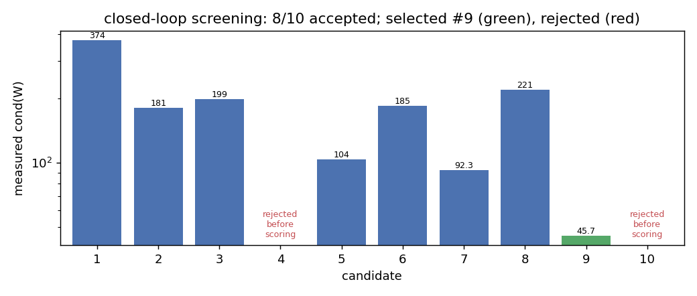

| 候选 | 基频 Hz | 谐波数 | 秩 | 条件数 | 最小奇异值 | 跟踪 RMS rad | 结果 |
| --- | --- | --- | --- | --- | --- | --- | --- |
| 1 | 0.20 | 3 | 22/22 | 374 | 0.041 | 0.012, 0.021, 0.015 | 通过 |
| 2 | 0.15 | 4 | 22/22 | 181 | 0.077 | 0.011, 0.020, 0.016 | 通过 |
| 3 | 0.10 | 3 | 22/22 | 199 | 0.058 | 0.012, 0.015, 0.013 | 通过 |
| 4 | 0.15 | 3 | 22/22* | 78.7* | 0.148* | 0.014, 0.019, 0.016 | 淘汰：加速度超限 |
| 5 | 0.10 | 3 | 22/22 | 104 | 0.114 | 0.013, 0.015, 0.014 | 通过 |
| 6 | 0.15 | 5 | 22/22 | 185 | 0.075 | 0.011, 0.019, 0.015 | 通过 |
| 7 | 0.10 | 3 | 22/22 | 92.3 | 0.123 | 0.013, 0.013, 0.016 | 通过 |
| 8 | 0.20 | 3 | 22/22 | 221 | 0.070 | 0.012, 0.020, 0.016 | 通过 |
| 9 | 0.10 | 3 | 22/22 | 45.7 | 0.248 | 0.013, 0.016, 0.017 | 选中 |
| 10 | 0.15 | 3 | 22/22* | 50.2* | 0.235* | 0.012, 0.019, 0.017 | 淘汰：加速度超限 |

带 `*` 的秩、条件数和最小奇异值来自解析轨迹预览；其余来自处理后的实测数据。提前淘汰的候选没有实测回归评分。

选中轨迹的一个周期如下，虚线为关节限位。

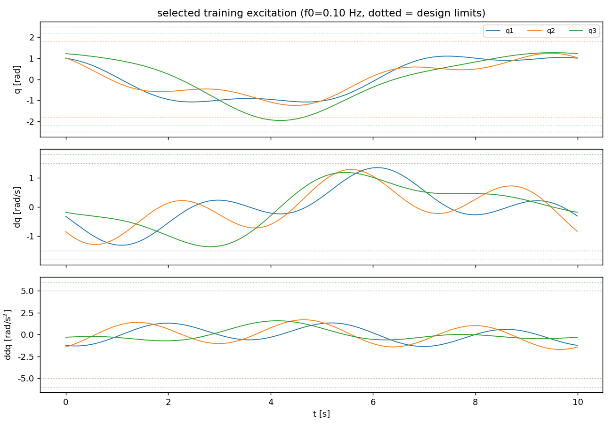

训练共采集 5000 点。经过延迟补偿、5 Hz 低通、边缘裁剪和低速剔除后，保留 3133 点；灰底标出被剔除的时段。跟踪 RMS 约 0.013、0.016、0.017 rad。

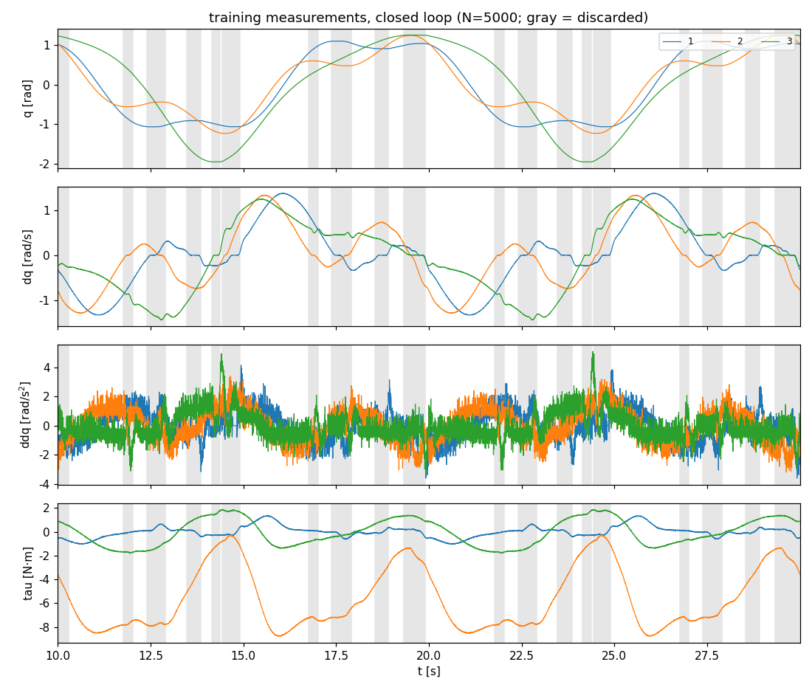

下图展示完整滤波序列（4848 点），白底的 3133 点参与辨识，灰底区间保留用于观察完整运动。

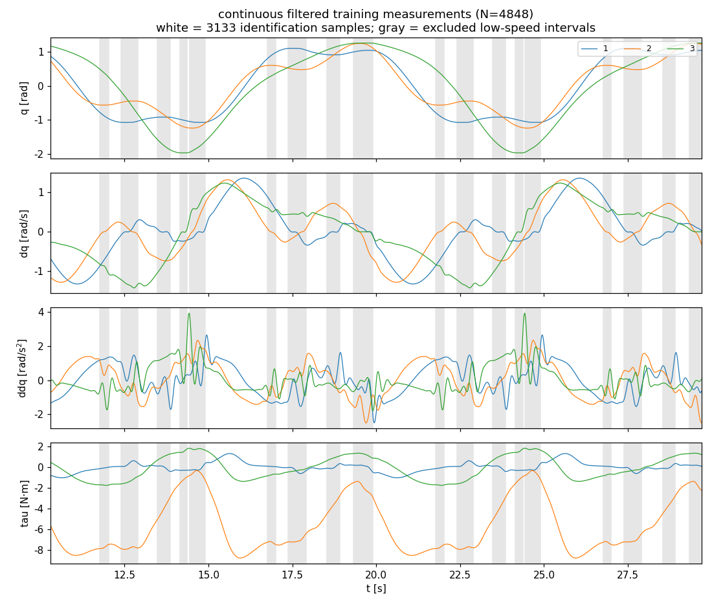

22 个基参数满秩，拟合残差 RMS 0.014 N·m。验证轨迹上，辨识模型的力矩预测误差小于名义模型。验证段关节 3 的实际加速度达到 7.98 rad/s²，超过配置上限 6 rad/s²；该轨迹仍只用于验证，超限记录保留在报告中。

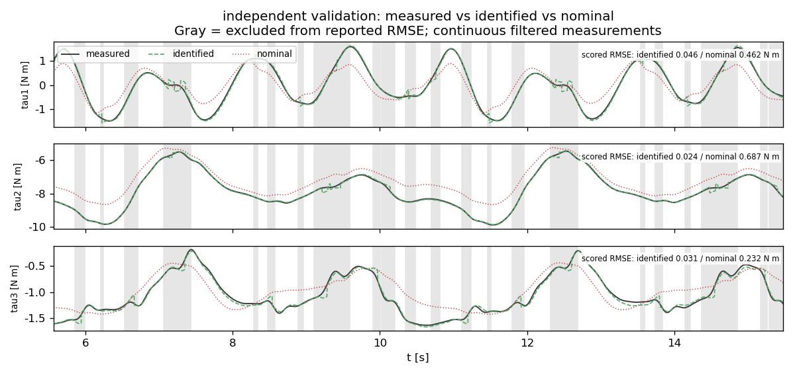

图中画出完整的 2480 点；下表与图上标注按其中 1570 个有效样本评分。把灰底低速段也计入后，整段总体 RMSE 为辨识模型 0.0622 N·m、名义模型 0.4810 N·m。

| 关节 | 测量 vs 辨识 (N·m) | 测量 vs 名义 (N·m) |
| --- | --- | --- |
| 1 | 0.046 | 0.462 |
| 2 | 0.024 | 0.687 |
| 3 | 0.031 | 0.232 |

基参数相对 MuJoCo 对象真值投影的误差是 5.19%。

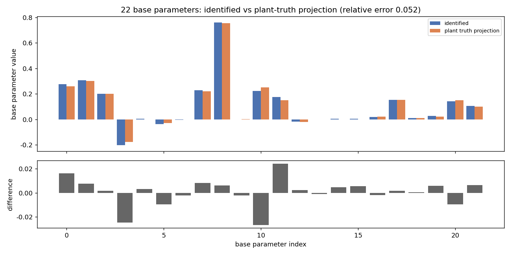

加入先验后，恢复结果通过全部检查，基参数匹配误差 0.00720（门槛 0.05），球包络违反量为 0。连杆 1 的质量由不带先验时的 0.001 kg 变为 3.000 kg，极小质量与大惯量的组合得到约束。各连杆质量均未贴界，但连杆 2 的 质心 z=0.044 m 贴上界，其质量与对象真值仍有差距；这些值仍是一组受先验影响的可行解。

恢复模型在同一验证有效样本上的总体力矩 RMSE 为 0.0321 N·m，上面的 0.0350 N·m 则是直接用辨识基参数的结果。恢复约束改善了参数量级，逐连杆参数仍不能唯一确定。

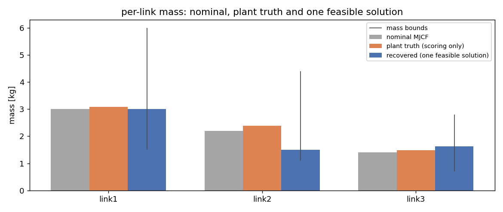

| 连杆 | 质量 真值 / 恢复 (kg) | 质心真值 (m) | 质心恢复 (m) |
| --- | --- | --- | --- |
| 1 | 3.082 / 3.000 | -0.003, -0.003, -0.118 | -0.000, 0.000, -0.120 |
| 2 | 2.382 / 1.501 | 0.141, 0.000, 0.023 | 0.204, -0.003, 0.044 |
| 3 | 1.488 / 1.623 | 0.102, 0.007, 0.001 | 0.095, 0.007, 0.000 |

<details>
<summary>RRR 逐连杆质心与质心惯量：一组可行解</summary>

下图同时给出名义模型、扰动后对象真值（仅离线评分）和恢复结果。质心用各连杆坐标系表示；惯量取质心为参考点、连杆坐标轴为方向，单位 kg·m²。连杆 2 的质心 z 上界已在图上标出。完整 3×3 矩阵见[惯性参数对照](docs/figures/rrr/inertia-comparison.json)。

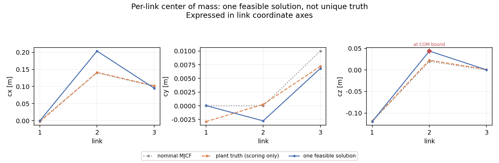

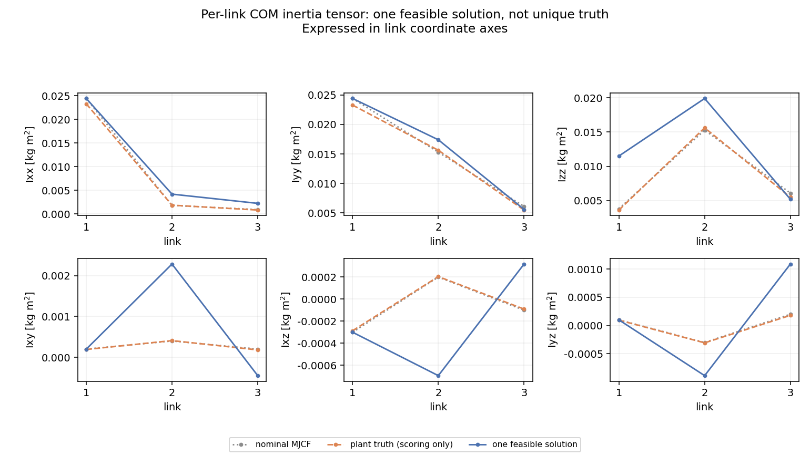

</details>

<a id="franka-results"></a>

### Franka Panda（7 轴，闭环，到 link7）

MuJoCo 3.4.0。对象模型为 `panda_arm_motor.xml`，与 RRR 使用相同的闭环流程：编码器量化、力矩通道误差、摩擦、执行器滞后；前馈用未扰动的名义模型。模型启用粘性/库仑摩擦和简化电机惯量后，有 62 个基参数；仅含刚体项时为 43 个。12 条傅里叶候选只做随机搜索和闭环试跑，没有 SLSQP 精炼。筛选只看秩、条件数、跟踪、饱和和样本保留率，不看力矩残差。

9 条通过，3 条淘汰。所有候选的最差关节跟踪 RMS 均在 0.008 rad 以内，且没有饱和。淘汰原因是低速剔除后的样本量不足，或实测最小奇异值低于 0.01。最终选择候选 4，实测条件数 225。

论文 N=5 系数与多初值 SLSQP 是刚体 43 参数、解析条件数上的独立对照，见 [Franka 激励 Notebook](notebooks/franka/excitation.ipynb)，没有放进这 12 条闭环候选。Notebook 当前保存结果：论文系数条件数 50.2；三个初值分别从 307、335、300 优化到 16.2、14.0、18.0，最佳为 14.0。

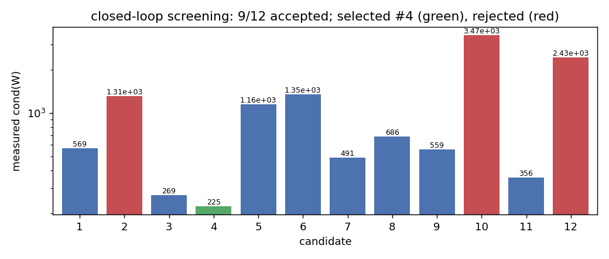

| 候选 | 基频 Hz | 谐波数 | 秩 | 条件数 | 最小奇异值 | 最差跟踪 RMS rad | 结果 |
| --- | --- | --- | --- | --- | --- | --- | --- |
| 1 | 0.20 | 3 | 62/62 | 569 | 0.039 | 0.007 | 通过 |
| 2 | 0.10 | 3 | 62/62 | 1310 | 0.016 | 0.007 | 淘汰：保留率 0.211 |
| 3 | 0.10 | 3 | 62/62 | 269 | 0.073 | 0.007 | 通过 |
| 4 | 0.10 | 5 | 62/62 | 225 | 0.082 | 0.008 | 选中 |
| 5 | 0.20 | 3 | 62/62 | 1160 | 0.018 | 0.006 | 通过 |
| 6 | 0.15 | 5 | 62/62 | 1350 | 0.017 | 0.006 | 通过 |
| 7 | 0.15 | 3 | 62/62 | 491 | 0.048 | 0.007 | 通过 |
| 8 | 0.20 | 4 | 62/62 | 686 | 0.038 | 0.006 | 通过 |
| 9 | 0.15 | 5 | 62/62 | 559 | 0.043 | 0.007 | 通过 |
| 10 | 0.20 | 4 | 62/62 | 3470 | 0.006 | 0.007 | 淘汰：激励强度不足 |
| 11 | 0.20 | 3 | 62/62 | 356 | 0.067 | 0.006 | 通过 |
| 12 | 0.15 | 3 | 62/62 | 2430 | 0.00999 | 0.005 | 淘汰：保留率 0.246；激励强度不足 |

选中轨迹的一个周期如下，虚线为关节限位和速度、加速度设计上限。

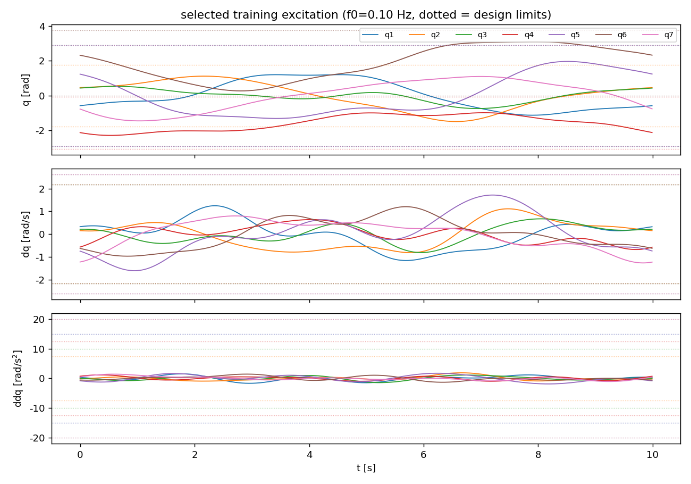

训练采集 5000 个点，来自闭环测量：17 位编码器量化后差分得到速度，加速度再微分，力矩读 `qfrc_actuator`。经过已知整数延迟补偿、5 Hz 零相位低通、边缘裁剪，并剔除任一关节 `|dq|<0.08` 的时刻后，保留 2255 点（45%）；灰底标出被剔除的时段。跟踪 RMS 约 0.002–0.008 rad，零饱和、零限位、零接触。

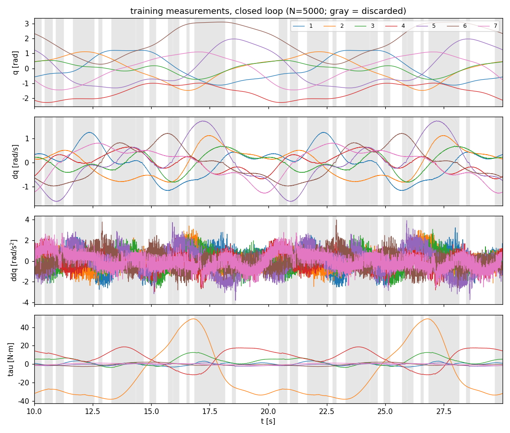

下图展示完整滤波序列（4848 点），白底的 2255 点参与辨识，灰底区间保留用于观察完整运动。

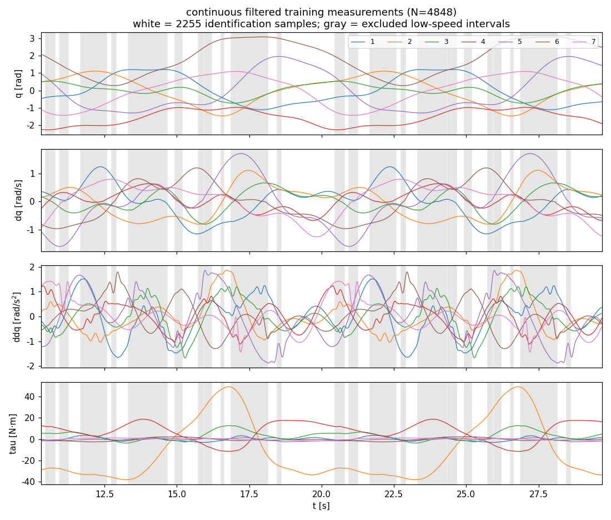

62 个基参数满秩，拟合残差 RMS 0.016 N·m（相对 0.13%）。验证轨迹在训练筛选之前固定，没有参与拟合。验证段的逐轴力矩误差见下图和表格。

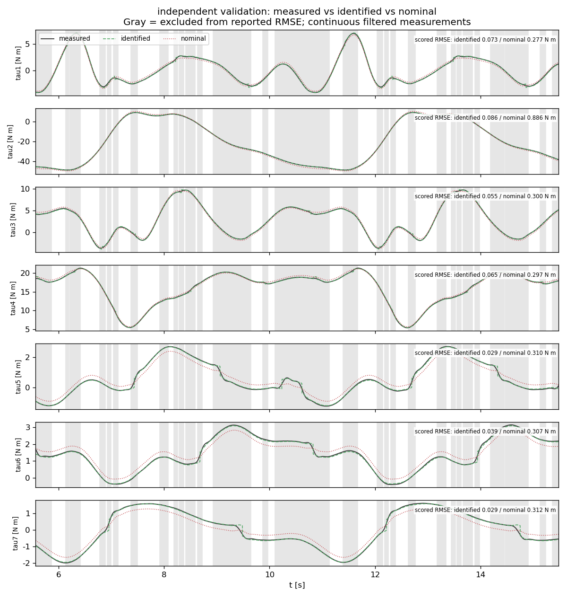

图中画出完整的 2480 点；下表与图上标注按其中 1087 个有效样本评分。把灰底低速段也计入后，整段总体 RMSE 为辨识模型 0.0779 N·m、名义模型 0.4483 N·m。

| 关节 | 测量 vs 辨识 (N·m) | 测量 vs 名义 (N·m) |
| --- | --- | --- |
| 1 | 0.073 | 0.277 |
| 2 | 0.086 | 0.886 |
| 3 | 0.055 | 0.300 |
| 4 | 0.065 | 0.297 |
| 5 | 0.029 | 0.310 |
| 6 | 0.039 | 0.307 |
| 7 | 0.029 | 0.312 |

基参数相对 MuJoCo 对象真值投影的误差是 2.98%。

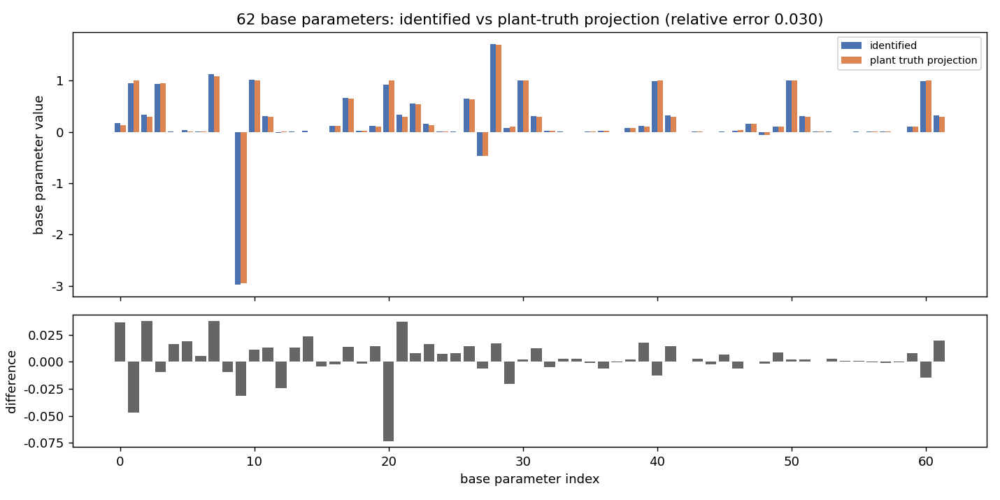

带先验的恢复通过 `solver_success`、`physical_feasible`、`geometry_feasible`、`matches_base`，基参数匹配误差 0.00729，球包络违反量为 0。恢复总质量 15.937 kg，名义值 16.062 kg。连杆 4 从旧解的 1.794 kg（贴下界） 变为 3.117 kg；所有质量和质心均未达到盒约束边界。

恢复模型在同一验证有效样本上的总体力矩 RMSE 为 0.0655 N·m，直接辨识基参数为 0.0576 N·m，名义模型为 0.4354 N·m。这里用少量预测精度换取了更合理的惯性参数量级；恢复值仍受先验影响，接近名义值不代表接近真值。

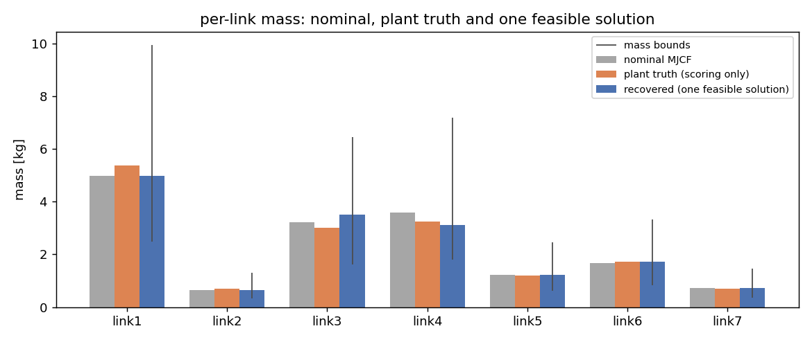

| 连杆 | 质量 名义 / 真值 / 恢复 (kg) | 恢复质心 (m) |
| --- | --- | --- |
| 1 | 4.971 / 5.381 / 4.970 | 0.004, 0.002, -0.048 |
| 2 | 0.647 / 0.688 / 0.653 | -0.015, -0.034, 0.012 |
| 3 | 3.229 / 3.019 / 3.518 | 0.030, 0.026, -0.085 |
| 4 | 3.588 / 3.249 / 3.117 | -0.055, 0.108, 0.022 |
| 5 | 1.226 / 1.197 / 1.228 | -0.009, 0.043, -0.033 |
| 6 | 1.667 / 1.729 / 1.712 | 0.056, -0.014, -0.011 |
| 7 | 0.736 / 0.708 / 0.737 | 0.011, -0.002, 0.058 |

<details>
<summary>Franka 逐连杆质心与质心惯量：一组可行解</summary>

名义模型、扰动后对象真值（仅离线评分）和恢复结果分开显示。质心与惯量坐标约定同 RRR；完整 3×3 惯量矩阵及数值见[惯性参数对照](docs/figures/franka/inertia-comparison.json)。加入先验后，连杆 4 的质量不再位于下界。部分惯量仍接近主惯量三角不等式边界，具体裕量见完整报告。

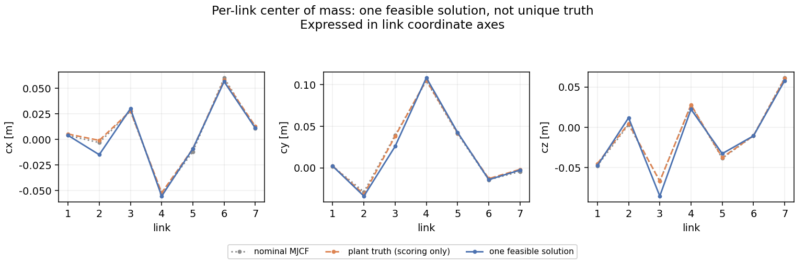

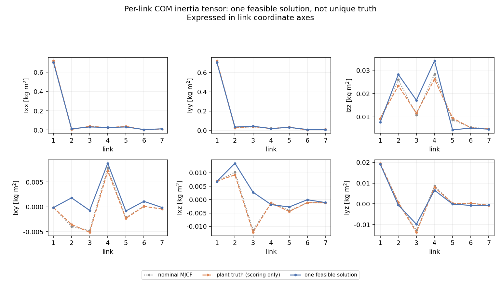

</details>

### 复现本页实验与图表

以下命令从采集开始复现实验，并使用带先验的恢复配置。RRR 的 8 条随机候选与 2 条优化候选组成表中的 10 条；Franka 使用 12 条随机候选。结果写入新的实验目录。

```bash
# 小矩阵运算使用单个 BLAS 线程，避免多线程调度占用大量时间
export OPENBLAS_NUM_THREADS=1 MKL_NUM_THREADS=1 OMP_NUM_THREADS=1

robot-identify --robot rrr --seed 0 --trials 8 --periods 2 \
  --config configs/rrr/realistic.json \
  --screening-config configs/rrr/screening.json \
  --optimize-excitation --optimization-starts 2 --optimization-maxiter 20 \
  --recover-inertia --recovery-config configs/rrr/recovery.json \
  --output-dir outputs/reproduce/rrr

robot-identify --robot franka --seed 0 --trials 12 --periods 2 \
  --config configs/franka/realistic.json \
  --screening-config configs/franka/screening.json \
  --no-optimize-excitation \
  --recover-inertia --recovery-config configs/franka/recovery.json \
  --output-dir outputs/reproduce/franka

# 从本页已有数据重建图表；重跑完整实验时改为 outputs/reproduce
PYTHONPATH=src python docs/figures/plot_experiment.py \
  --robot rrr --output-dir outputs/showcase-prior/rrr --figure-dir docs/figures/rrr
PYTHONPATH=src python docs/figures/plot_experiment.py \
  --robot franka --output-dir outputs/showcase-prior/franka --figure-dir docs/figures/franka
```

已有 `showcase-fresh` 数据时，可单独重做惯性恢复。输出路径必须尚不存在，示例使用 `recovered-again`：

```bash
PYTHONPATH=src python -m robot_model.cli.recover_inertia --robot rrr \
  --input-dir outputs/showcase-fresh/rrr --recovery-config configs/rrr/recovery.json \
  --output-dir outputs/recovered-again/rrr
PYTHONPATH=src python -m robot_model.cli.recover_inertia --robot franka \
  --input-dir outputs/showcase-fresh/franka --recovery-config configs/franka/recovery.json \
  --output-dir outputs/recovered-again/franka
```

本页数据使用 MuJoCo 3.4.0、NumPy 1.26.4、SciPy 1.11.4、SymPy 1.12。不同依赖版本下，数值优化结果可能有差异。绘图脚本会检查连续序列在保留样本处与保存数据一致、重新计算原评分区间的验证误差并核对报告，整段误差另存于 `summary.json` 的 `continuous_validation`，同时导出 `summary.json`、`report.json` 和 `inertia-comparison.json`；完整报告含基参数表达式、辨识值、恢复参数和验收记录。

## 目录导航

```text
robot_model/
├── src/robot_model/          # 可安装、可复用的 Python 库
│   ├── robot.py             # Robot 统一建模入口
│   ├── geometry/            # DH / MDH / PoE、坐标系与约定
│   ├── kinematics/          # 正运动学相关计算、雅可比
│   ├── dynamics/            # 逆动力学、回归矩阵、最小参数集
│   ├── export/              # 公式、Python、C 导出
│   ├── robots/              # RRR / Franka 定义及模型资源定位
│   ├── excitation/          # 傅里叶轨迹、搜索、筛选、约束优化
│   ├── simulation/          # MuJoCo 对象、控制、传感器、执行器
│   ├── data/                # MotionData、对齐、滤波、周期平均
│   ├── identification/      # 基参数估计、完整惯性参数恢复、力矩预测和分解
│   ├── experiments/         # 将上述模块连接成实验流程
│   ├── cli/                 # 参数解析与命令行入口
│   ├── assets/models/       # 随包分发的 MJCF、网格、许可信息
│   └── utils/               # 数学、符号和通用校验
├── configs/rrr/             # RRR 仿真参数、筛选阈值、惯性恢复约束
├── configs/franka/          # Franka 同上；增益与摩擦是仿真假设
├── scripts/                # 几何先验复查、Franka 历史调参脚本
├── notebooks/              # RRR / Franka 的交互式实验与推导
├── tests/                  # 按机器人和功能组织的自动化测试
├── docs/                   # 工程原理与接口说明、展示图表
└── outputs/                # 展示实验与符号导出纳入 Git，其他实验默认忽略
```

`src/robot_model/data/` 放数据结构与处理代码；实验数据文件放 `outputs/`。
符号导出和实验结果统一保存在 `outputs/`；`build/` 只用于打包临时文件。

## 后续功能放哪里

- 筛选激励轨迹：`excitation/screening.py`；多场景筛选：`excitation/robust.py`。
- 设计新轨迹或优化目标：`excitation/trajectory.py`、`search.py`、`optimization.py`。
- 增加电机、传感器或仿真实机误差：`simulation/hardware.py`、`sensors.py`、`realistic.py`。
- 修改预处理：`data/`；增加辨识算法：`identification/`。
- 恢复连杆质量、质心和惯性张量：`identification/recovery.py`。
- 增加机器人：`robots/` 与 `assets/models/`；增加实验组合：`experiments/` 与 `configs/`。

跨模块编排集中在 `experiments/realistic.py`，共用预处理放在 `experiments/pipeline.py`；各机器人模块提供配置和模型描述。
`data/` 与 `identification/` 保持独立于仿真器，基础模块不反向导入 `experiments/`、`cli/`、测试或 Notebook；通用参数校验放在 `utils/validation.py`。

## 使用库

```python
from robot_model import Robot
from robot_model.robots import RRR_MDH_PARMS
from robot_model.excitation import search_excitation, screen_excitation
from robot_model.data import MotionData, filter_measurements
from robot_model.identification import identify
from robot_model.simulation import RealisticMujocoSource

robot = Robot.from_mdh("rrr_arm", RRR_MDH_PARMS)
```

激励设计接收回归函数；筛选接收采集函数；辨识只接收处理后的测量数据。
基参数辨识完成后，可以用 `recover_inertial_parameters()`，结合名义初值、参数界限和物理条件罚项，
求出一组完整惯性参数；它通常不是唯一解，使用方法见[惯性参数恢复](docs/principles.md#8-完整惯性参数如何恢复)。
MuJoCo 的真实惯性参数用于验证评分。未来接入实机时可以沿用 `MotionData` 和辨识接口，
再实现真实设备的数据采集与控制；当前工程尚未提供真实设备驱动。

## 展示图表约定

RRR 和 Franka 分别使用各自的数据生成图表，原始、处理后数据以及报告应来自同一次实验：

- 激励筛选展示整批候选的评分、可执行性和淘汰原因，再画选中轨迹；解析预览、实测评分和独立论文对照明确区分。
- 训练数据说明测量误差来源，并同时展示原始数据与连续滤波序列，灰底标出剔除的低速区间；重建后的保留样本须与实际辨识数据逐点一致。
- 力矩预测使用独立验证轨迹。原报告 RMSE 按有效样本计算，整段误差、测量域误差和真值域误差分别记录；绘图时重新核对评分。
- 惯性参数先展示基参数，再按实际恢复情况展示逐连杆质量、质心和惯量；注明“一组可行解”、先验来源及贴界情况，不把力矩拟合好解释为逐连杆参数唯一准确。

同一套展示图和 JSON 应一起更新。筛选与恢复的数据使用规则见[工程原理](docs/principles.md)。

## 维护约定

每次实验使用独立的 `outputs/<机器人>/<实验名>/`，保存配置、测量、筛选和恢复报告；
符号导出写到 `outputs/rrr_symbolic/` 或 `outputs/franka_symbolic/`。Git 保留两组展示实验及这两个符号目录，其他实验默认忽略；新增正式结果时，在 `.gitignore` 中放行对应目录并更新 [产物说明](outputs/README.md)。`outputs/` 是实验成果，不整体当作缓存删除。
README 的 `docs/figures/` 图片与 JSON 从同一实验目录成套生成，更新规则见[展示图表约定](#展示图表约定)。

可清理 Python/pytest 缓存、Notebook 检查点，以及未在使用的 `build/`、`dist/`。
保留模型网格、许可文件和可视化使用的 `_viz_q0_scene.xml`；有复查价值的辅助脚本放在 `scripts/`。

```bash
python -m pytest -q -m "not slow"   # 常规建模、辨识与闭环流程
python -m pytest -q -m slow         # 包括 Franka 完整符号导出
python -m pip wheel . --no-deps --wheel-dir dist
```

GUI 查看器需要桌面环境，不属于上述自动化测试。

## 文档

- [工程原理：建模、激励、辨识与惯性参数恢复](docs/principles.md)
- [建模接口、坐标约定与公式导出](docs/principles.md#建模接口与公式导出)
- [辨识接口与实验选项](docs/principles.md#辨识接口与实验选项)
- [Notebook 入口](notebooks/README.md)
- [实验配置](configs/README.md)
- [辅助实验脚本](scripts/README.md)
- [实验产物与版本管理](outputs/README.md)
